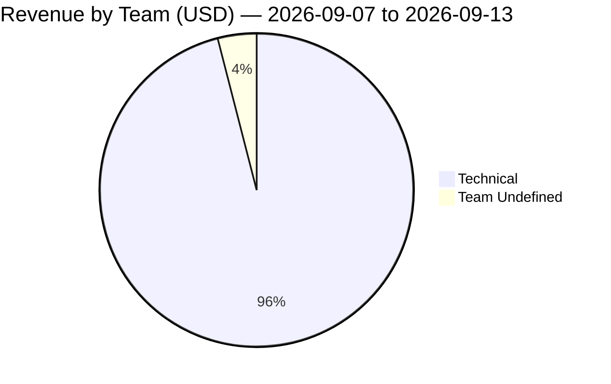

# Example — which team is earning more revenue

**User:** which team is earning more revenue

Grain = **Team**. Revenue-only. Current week. Do not send `organizeBy`. Do not ASK cost rate — recall `costRateSource=0` if the first call returns `needs_cost_rate_source`.

```
ers_report_get
  report=financial
  reportType=planned_vs_actual
  startDate=2026-09-07
  endDate=2026-09-13
```

If `needs_cost_rate_source`, recall with `costRateSource=0` (revenue does not use cost rate).

COPY `data.report.groups.udf_team[]`: `revenue` / `actual_revenue`, `profit_loss`, `label` or type option for `id`. Never send `"Team Undefined"` as a filter value; still print `is_undefined` rows.

Rank by revenue. Mermaid pie + table. Currency from `admin.currency`.

**Wrong:** `organizeBy=Team`. **Wrong:** `report=utilization`. **Wrong:** hours × rate.

**Right:**



# Revenue — 2026-09-07 to 2026-09-13

Basis: bookings and timesheets
Currency: USD · Profit %: Profit / Revenue

Top: Technical — 12000 USD

| Team | Revenue | Profit | Profit % |
|---|---:|---:|---:|
| Technical | 12000 | 2400 | 20% |

Same path for **project** (sum allocation lines by `project_id`) and **department** / **location** (`groups.udf_department` / `groups.udf_location`).
